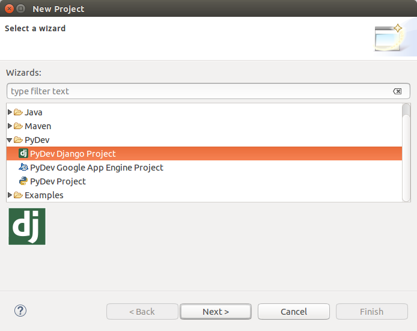
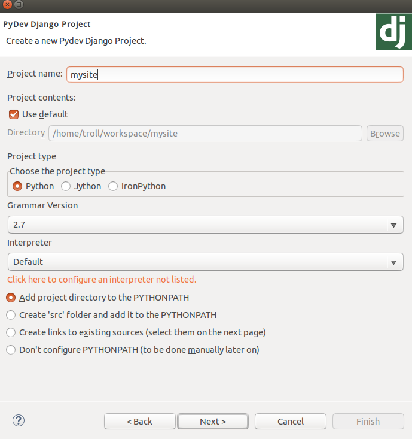
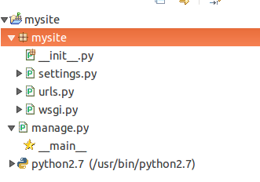

# 创建Django Project

下面打开eclipse，找到左上角的Fil选项卡，New-other...，展开Pydev，选择Pyde Djang Project。



选择Next，然后我们输入工程名为mysit，其他保持不动，然后一路Next，最后Finish。



这时候，eclipse左边应该出现了一个mysite的工程，他的结构大概是这样的：



这就表明我们已经创建成功。下面让我来解释一下这些文件的作用：
* 根文件```mysite/```：包含了工程所有需要的文件，你可以随便命名工程名，当然不能命名位Django，因为Djang已经在python定义为一个包，重复定义会造成歧义。
* ```mysite/manage.py```：是一个命令行文件，可以在很多方面改变的你Django工程，具体的可以戳[这里](https://docs.djangoproject.com/en/1.8/ref/django-admin/)
* ```mysite/mysite/```：包含的是你的工程的python包，可以在其他文件中这样使用(<code>import mysite.urls</code>)
* ```mysite/\_\_init\_\_.py```：这个文件里面是空的，，他的作用是告诉Pytho这个目录应该当成一个包来使用
* ```mysit/settings.py```：Django工程的一些设置，具体的可以使劲戳[这里](https://docs.djangoproject.com/en/1.8/topics/settings/)
* ```mysite/urls.py```：处理URL请求，具体的可以看[这里](https://docs.djangoproject.com/en/1.8/topics/http/urls/)
* ```mysite/wsgi.py```：一个为了与WSGI兼容的入口点，想要详细了解请点[这里](https://docs.djangoproject.com/en/1.8/howto/deployment/wsgi/)
